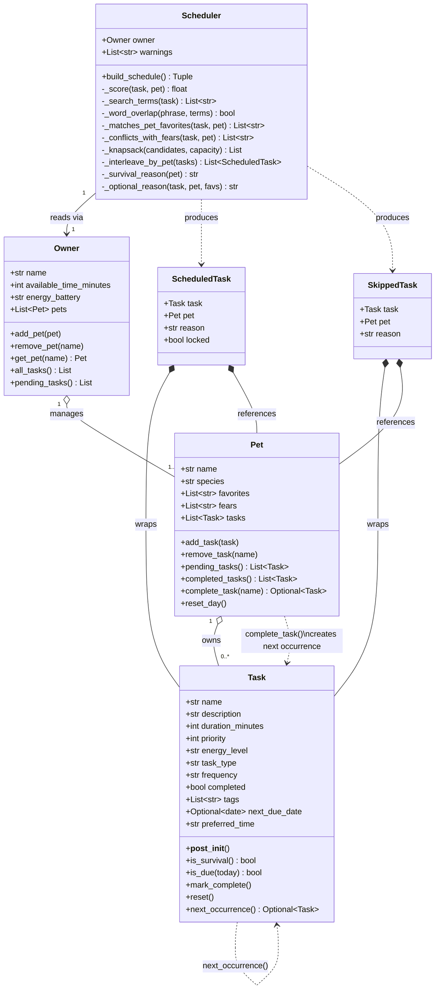

# PawPal+ (Module 2 Project)

You are building **PawPal+**, a Streamlit app that helps a pet owner plan care tasks for their pet.

## Scenario

A busy pet owner needs help staying consistent with pet care. They want an assistant that can:

- Track pet care tasks (walks, feeding, meds, enrichment, grooming, etc.)
- Consider constraints (time available, priority, owner preferences)
- Produce a daily plan and explain why it chose that plan

Your job is to design the system first (UML), then implement the logic in Python, then connect it to the Streamlit UI.

## What you will build

Your final app should:

- Let a user enter basic owner + pet info
- Let a user add/edit tasks (duration + priority at minimum)
- Generate a daily schedule/plan based on constraints and priorities
- Display the plan clearly (and ideally explain the reasoning)
- Include tests for the most important scheduling behaviors

## Getting started

### Setup

```bash
python -m venv .venv
source .venv/bin/activate  # Windows: .venv\Scripts\activate
pip install -r requirements.txt
```

### Suggested workflow

1. Read the scenario carefully and identify requirements and edge cases.
2. Draft a UML diagram (classes, attributes, methods, relationships).
3. Convert UML into Python class stubs (no logic yet).
4. Implement scheduling logic in small increments.
5. Add tests to verify key behaviors.
6. Connect your logic to the Streamlit UI in `app.py`.
7. Refine UML so it matches what you actually built.

---

## Class Diagram (Reverse-Engineered)



### How the data flows

| Step | What happens |
|------|-------------|
| **1. Input** | An `Owner` (holding `Pet` objects, each holding `Task` objects) is passed into `Scheduler.__init__` |
| **2. Due-date filter** | `build_schedule` calls `Owner.pending_tasks()` then drops any `Task` whose `next_due_date` is in the future; those go straight to the skipped list |
| **3. Lock survival** | Tasks where `priority == 1` or `task_type == "survival"` are locked in unconditionally and sorted by `preferred_time`; a warning is added to `scheduler.warnings` if they exceed the time budget |
| **4. Fear filter** | Remaining optional tasks are checked with `_conflicts_with_fears()` using whole-word token matching; conflicting tasks are skipped before scoring |
| **5. Score & knapsack** | Each candidate is scored per-minute (`_score()`: priority weight − energy mismatch + favourites bonus + daily bonus), then `_knapsack()` selects the optimal subset that maximises total score within the remaining time |
| **6. Interleave & sort** | Selected optional tasks are round-robin interleaved across pets by `_interleave_by_pet()`, with each pet's queue sorted by `preferred_time` (`morning → afternoon → evening`) |
| **7. Output** | Returns `(List[ScheduledTask], List[SkippedTask], summary_note)`; `scheduler.warnings` holds any budget or free-time alerts |
| **8. Completion** | Calling `pet.complete_task(name)` marks the task done and appends the next occurrence (via `Task.next_occurrence()`) with the due date advanced by the correct interval |

---

## Smarter Scheduling

The scheduler was upgraded with eleven improvements that make daily planning more accurate, fair, and realistic.

**Better task selection**

The original greedy fill was replaced with a **0/1 knapsack algorithm** that evaluates all candidate tasks together and selects the combination that maximises total value within the available time — not just the first tasks that happen to fit. Tasks are scored **per minute** (score ÷ duration) so a short high-quality task is never buried by a long mediocre one. `daily` tasks also receive a score bonus over `weekly` or `as-needed` tasks, since missing a daily task has a higher cost.

**Fairer multi-pet scheduling**

Optional tasks are assigned in a **round-robin pass** across pets, so every animal gets at least one enrichment slot before any pet receives a second. Within each pet's queue, tasks are ordered by `preferred_time` (`"morning"` → `"afternoon"` → `"evening"`) to produce a schedule that follows a natural daily flow regardless of the order tasks were added.

**Smarter filtering**

Fear matching was upgraded from substring search to **whole-word token matching**, preventing false conflicts (e.g. a fear of `"loud"` no longer blocks a task tagged `"cloud"`). Tasks with a `next_due_date` in the future are automatically deferred and appear in the skipped list with the exact date they are next needed — useful for weekly grooming, monthly vet checks, and similar recurring care.

**Automatic rescheduling**

Calling `pet.complete_task(name)` marks a task done and immediately appends a **next-occurrence copy** to the pet's task list with the due date advanced by the correct interval (`+1 day` for daily, `+7 days` for weekly). `as-needed` tasks return `None` — no copy is created. The new instance is a full independent copy, so editing or completing it does not affect the original.

**Guardrails and visibility**

`Task.__post_init__` validates that `priority` is in the range 1–5 at construction time, raising a `ValueError` before a bad value can silently distort scoring. `Owner.all_tasks()` and `Pet.add_task()` deduplicate by object identity, so sharing a `Task` object across pets never produces a double-scheduled entry. After every `build_schedule()` call, `scheduler.warnings` holds plain-English alerts — including a budget warning when survival tasks alone exceed the owner's available time, and a free-time summary showing how many minutes remain.

---

## Testing PawPal+

### Run the tests

```bash
python -m pytest
```

To see each test name as it runs:

```bash
python -m pytest -v
```

### What the tests cover

The suite has **64 tests** across two files (`test_logic.py` and `tests/test_pawpal.py`) and covers every major class and scheduling behaviour:

| Area | What is tested |
|---|---|
| **Task** | Attributes stored correctly, `completed` defaults to `False`, `mark_complete()` / `reset()` toggle the flag, `is_survival()` returns `True` for priority-1 and `task_type="survival"` tasks |
| **Pet** | `add_task()` / `remove_task()`, `pending_tasks()` excludes completed tasks, `completed_tasks()` returns only done tasks, `reset_day()` clears all flags |
| **Owner** | `add_pet()` / `remove_pet()` / `get_pet()`, `get_pet()` raises `ValueError` for unknown names, `pending_tasks()` aggregates correctly across multiple pets and excludes completed tasks |
| **Survival tasks** | Always appear in the schedule even when available time is nearly zero, always carry `locked=True`, are never blocked by fear filters |
| **Fear filtering** | Tasks whose tags overlap with a pet's fears are skipped, the skip reason names the fear, non-feared tasks are unaffected, fear is enforced even with unlimited time |
| **Time constraints** | Tasks that exceed available time are skipped, the skip reason states the duration needed and the minutes remaining, a task that fits exactly on the budget is always included, total scheduled time never exceeds `available_time_minutes` |
| **Priority & scoring** | Higher-priority tasks beat lower-priority ones when only one slot exists, a pet-favourite task is preferred over a same-priority non-favourite, the Pet's Perspective reason names the matched favourite |
| **Energy matching** | A low-energy owner gets low-energy tasks ranked above high-energy ones of equal priority, a high-energy owner schedules high-energy tasks without penalty |
| **Summary note** | The closing note changes wording based on owner energy level (`"easy day"` vs `"maximum paw-tential"`) |

### Confidence level

**4 / 5 stars**

The core scheduling contract — survival locking, fear filtering, time budgeting, priority/energy/favourites scoring — is thoroughly tested and all 64 tests pass. One star is withheld because the newer features added in the Smarter Scheduling upgrade (knapsack optimality, round-robin pet interleaving, `preferred_time` sort order, `next_due_date` deferral, and `complete_task()` auto-rescheduling) do not yet have dedicated tests. The logic runs correctly as shown in the terminal demo, but without automated assertions a future change could quietly break those behaviours.
